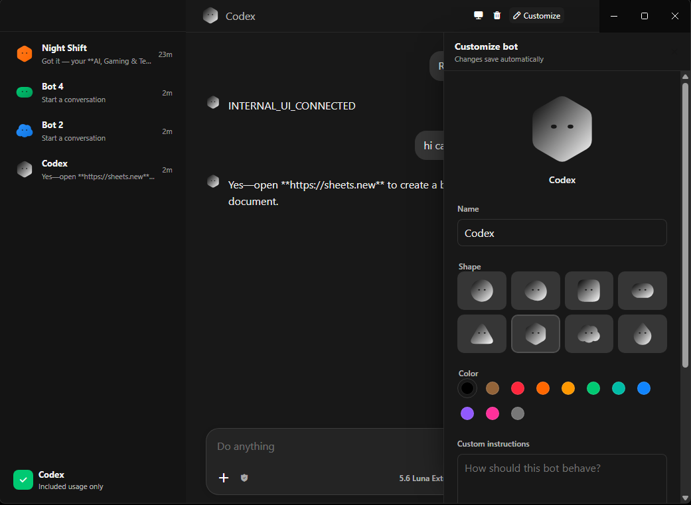

# Chat Bot 0.18 — reconstructed from Grok Bot 0.18 and extended



Unofficial Windows-capable desktop client focused on **ChatGPT / Codex**, built from a source-oriented reconstruction of the publicly shipped Grok Bot 0.18.0.

> **Important legal notice**  
> This is an independent research / experimental project. It is **not** affiliated with, endorsed by, or licensed by Anysphere, Cursor, OpenAI, xAI, or any related company.  
> The reconstructed code is derived from analysis of a proprietary binary. **No upstream source-code license is granted.**
> 
## What this project is

- Readable TypeScript reconstruction of the Electron main process, host, coordinator, protocol, and related runtime pieces of Grok Bot 0.18.0
- Windows x64 packaging support (primary target)
- Inference router with strong focus on **Codex / ChatGPT** (local login via existing Codex auth)
- Optional local Docker sandbox
- Standalone local workspace optimized for Codex on Windows

It is **not** an official Grok Bot, Cursor, or OpenAI product.

## Primary features (Windows + Codex)

- Uses your existing ChatGPT/Codex login (`%USERPROFILE%\.codex\auth.json`)
- Local bots with per-bot history, name, color, custom instructions, and model/reasoning selection
- Compact native Windows workspace (sidebar, transcript, composer)
- Model choices currently include 5.6 Sol / Terra / Luna, 5.5, 5.4 (availability depends on your account)
- Local usage tracking

Other providers (Cursor session, Claude Code, OpenRouter) remain available via the router but are secondary.

## Requirements

- Windows 10/11 x64 (primary)
- Node.js 26.5.x
- Git LFS
- Docker Desktop (optional, for local sandbox)
- Codex installed and signed in with a ChatGPT account

macOS Apple Silicon is also supported by the reconstruction tooling.

## Quick start (Windows)

```powershell
git clone https://github.com/vladvrx/chat-bot-windows.git
cd chat-bot-windows
git lfs install
git lfs pull
npm ci
npm run bootstrap
npm run package:windows
export procedure, see [docs/PUBLISHING.md](docs/PUBLISHING.md). Technical
provenance and retained upstream boundaries are described in
[PROVENANCE.md](PROVENANCE.md) and [NOTICE.md](NOTICE.md).
